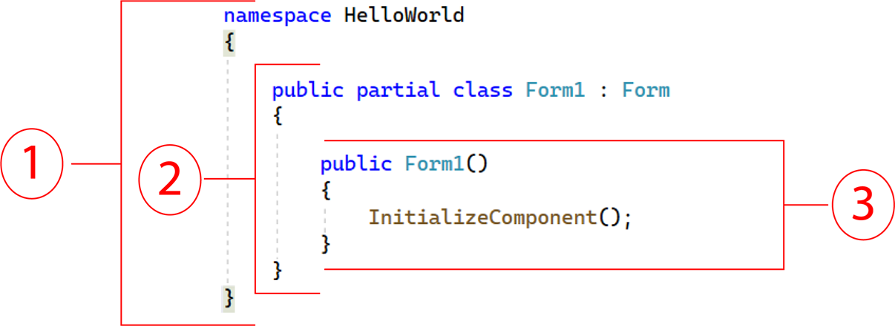

##  TOPICS
1.1 Objects
1.2 The Program Development Process
1.8 Getting Started with Visual Studio
2.1 Getting Started with Forms and Controls
2.2 Creating the G U I for Your First Visual C# Application
2.3 Introduction to C# code
2.4 Writing Code for the Hello World Application
2.5 Label Controls
2.6 Making Sense of IntelliSense
2.7 PictureBox Controls
2.8 Comments, Blank Lines, and Indentation
2.9 Writing the Code to Close an Application’s Form
2.10 Dealing with Syntax Errors
## OBJECTS
An object is a program component that contains data and performs operations, Programs use objects to perform specific tasks.
Most programming languages use object-oriented programming in which a program component is called an “object”
Program objects have properties (or fields) and methods
Properties – data stored in an object
Methods – the operations an object can perform

## CONTROLS
Objects that are visible in a program G U I are known as controls
Commonly used controls are Labels, Buttons, and TextBoxes
They enhance the functionality of your programs
There are invisible objects in a G U I such as Timers, and OpenFileDialog
A class is code that describes a particular type of object

## Getting Started with Visual Studio 
Visual Studio is a professional integrated development environment (I D E)
The Visual Studio Environment includes:
Designer Window
Solution Explorer Window
Properties Window

## Toolboxs
Toolbox is a window for selecting controls to use in an application
Typically appears on the left side of Visual Studio environment
Often is in Auto Hide mode
Toolbox is a window for selecting controls to use in an application
Divided into sections such as “All Windows Forms” and “Common Controls

## Tooltips
A Tooltip is a small box that pops up when you hover the mouse pointer over an item on the toolbar or toolbox

## Specifying the Project Name
You can specify the project name the first time you save the project.

##  Displaying the Designer
Sometimes when you open an existing project, the project’s form will not be automatically displayed in the Designer
You should:
Right click Form1.c s in the Solution Explorer
Click View Designer in the pop-up menu

##
A form in Designer is enclosed with thin dotted lines called the bounding box
The bounding box has small sizing handles; you can use them to resize the form

## Adding Controls to a Form
In the Toolbox, select the Control (e.g. a Button), then you can either:
double click the Button control
click and drag the Button control to the form
On the form, you can
resize the control using its bounding box and sizing handles
move the control’s position by dragging it
change its properties in the Properties window

## Deleting a Control
Deleting a control is simple: you select it and then press the key on the keyboard

## Rules for Naming Controls
 Controls’ are identified by their names in code
 Control names are also known as identifiers.
 The naming rules are:
 The first character must be a letter (lower or uppercase, does not matter) or an underscore (_)
 All other characters can be alphanumerical characters or underscores
 The name cannot contain spaces

## Introduction to c sharp  Code
 code is primarily organized in three ways: namespaces, classes, and methods

 Namespace: a container that holds classes
 Class: a container that holds methods
 Method: a group of one or more programming statements that perform some operations
 A file that contains program code is called a source code file
 ## Organization of the Form1.c s
 The user-defined namespace of the project
 Class declaration
 A method
 

##  Message Boxes
 A message box (a k a dialog box) displays a message
 .NET provides a method named MessageBox.Show
 The method displays a window with a message. A sample code is (bold line):
 
 
 private void myButton_Click(object sender, EventArgs e)
 {
    MessageBox.Show("Thanks for clicking the button!");
 }
 Placing it in the myButton_Click event handler can display the string in the message box when the button is clicked
 ## Label Controls
 A Label control displays text on a form and can be used to display unchanging text or program output
 Commonly used properties are:
 Text: gets(read) or sets(write/change) the text associated with Label control
 Name: gets or sets the name of Label control
 Font: allows you to set the font, font style, and font size
 BorderStyle: allows you to display a border around the control’s text
 AutoSize: controls the way they can be resized
 TextAlign: set the text alignments

## Making Sense of IntelliSense
 IntelliSense provides automatic code completion as you write programming statements
 IntelliSense is a smart code completion feature. As you type in your code, it automatically suggests possible keywords, variables, methods, classes, or properties that you might want to use.
 It provides an array of options that make language references easily accessible
 With it, you can find the information you need, and insert language elements directly into your code
## picture box
 A PictureBox control displays a graphic image on a form
 Commonly used properties are:
 Image: specifies the image that it will display
 SizeMode: specifies how the control’s image is to be displayed
 Visible: determines whether the control is visible on the form at run time

## Comments, Blank Links, and Indentation
 Comments are brief notes that are placed in a program’s source code to explain how parts of the program work
 A line comment appears on one line in a program

 // Make image of the card back visible.
 cardBackPictureBox.Visible = true;
 A block comment can occupy multiple consecutive lines in a program
 /*
    Line one
    Line two
 */
 
 
 
 
 
 
